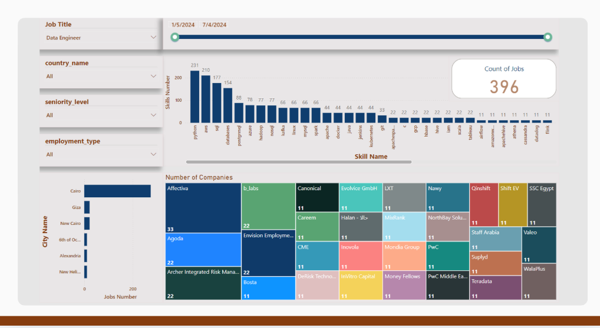

# 🕷️ Jobs Scraper Pipeline

An end-to-end automated pipeline that **scrapes**, **processes**, **stores**, and **visualises** job market data from LinkedIn and Wuzzuf — orchestrated daily by Apache Airflow.

---

## Pipeline overview

```
LinkedIn · Wuzzuf
      │
      ▼  (Scrapy + Playwright)
  Raw CSV
      │
      ▼  (NLP · NER · geocoding · date normalisation)
  Clean data
      │
      ▼  (SQLAlchemy upsert)
  MySQL star schema
      │
      ▼
  Power BI dashboard
```

---

## Project structure

```
jobs-scraper/
├── scraper/                 # Scrapy project
│   ├── spiders/
│   │   ├── linkedin.py      # LinkedIn CrawlSpider
│   │   ├── wuzzuf.py        # Wuzzuf CrawlSpider
│   │   └── URLs.py          # URL pagination helper
│   ├── items.py             # Item definitions + NLP processors
│   ├── pipelines.py
│   └── settings.py
│
├── processing/
│   └── db_insertion.py      # Clean & upsert scraped data into MySQL
│
├── dags/
│   └── job_scraper_dag.py   # Airflow DAG (scrape → store, daily)
│
├── sql/
│   └── schema.sql           # MySQL star schema DDL
│
├── dashboard/
│   └── README.md            # Power BI connection & visual guide
│
├── data/                    # Gitignored — holds scraped CSVs locally
├── .env.example             # Environment variable template
├── requirements.txt
└── scrapy.cfg
```

---

## Quickstart

### 1 · Clone and set up environment

```bash
git clone https://github.com/YOUR_USERNAME/jobs-scraper.git
cd jobs-scraper

python3 -m venv venv
source venv/bin/activate

pip install -r requirements.txt
playwright install chromium
```

### 2 · Configure credentials

```bash
cp .env.example .env
# Edit .env with your MySQL credentials and project path
```

### 3 · Initialise the database

```bash
mysql -u root -p < sql/schema.sql
```

### 4 · Run a spider manually

```bash
# LinkedIn
scrapy crawl linkedin -o data/scraped_data.csv

# Wuzzuf
scrapy crawl wuzzuf -o data/scraped_data.csv
```

### 5 · Insert data into MySQL

```bash
python processing/db_insertion.py --csv data/scraped_data.csv
```

### 6 · Set up Airflow automation

```bash
export AIRFLOW_HOME=~/airflow
airflow db init
airflow users create --username admin --role Admin --firstname You --lastname You --email you@example.com --password admin

# Copy DAG
cp dags/job_scraper_dag.py ~/airflow/dags/

# Start services
airflow webserver --port 8080 &
airflow scheduler &
```

Open [http://localhost:8080](http://localhost:8080) and enable the `job_scraper_pipeline` DAG.

---

## Database schema

```
jobs_dim ──────────┐
companies_dim ─────┤──► job_postings_fact ──► job_posting_skills ──► skills_dim
cities_dim ────────┤
  └── countries_dim┘
```

| Table | Description |
|-------|-------------|
| `jobs_dim` | Normalised job titles, seniority, employment type |
| `companies_dim` | Hiring companies |
| `countries_dim` | Countries |
| `cities_dim` | Cities with FK to country |
| `skills_dim` | Technology skills extracted by NER |
| `job_postings_fact` | One row per unique job posting |
| `job_posting_skills` | Bridge table — postings ↔ skills |

---

## Key technologies

| Layer | Technology |
|-------|-----------|
| Scraping | [Scrapy](https://scrapy.org) + [scrapy-playwright](https://github.com/scrapy-plugins/scrapy-playwright) |
| NLP / NER | [HuggingFace Transformers](https://huggingface.co) — `GalalEwida/LLM-BERT-Model-Based-Skills-Extraction-from-jobdescription` |
| Job title normalisation | [Sentence Transformers](https://www.sbert.net) + cosine similarity |
| Geocoding | [Geopy](https://geopy.readthedocs.io) (Nominatim) |
| Storage | MySQL 8 via [SQLAlchemy](https://www.sqlalchemy.org) |
| Orchestration | [Apache Airflow](https://airflow.apache.org) (daily DAG) |
| Visualisation | Power BI |

---

## Environment variables

| Variable | Description |
|----------|-------------|
| `DB_USERNAME` | MySQL username |
| `DB_PASSWORD` | MySQL password |
| `DB_HOST` | MySQL host (default `127.0.0.1`) |
| `DB_PORT` | MySQL port (default `3306`) |
| `DB_NAME` | Database name (default `jobs`) |
| `PROJECT_ROOT` | Absolute path to this repo |

---

## Sources scraped

- **LinkedIn Jobs** — global job postings (JS-rendered via Playwright)
- **Wuzzuf** — Egypt-focused job board

